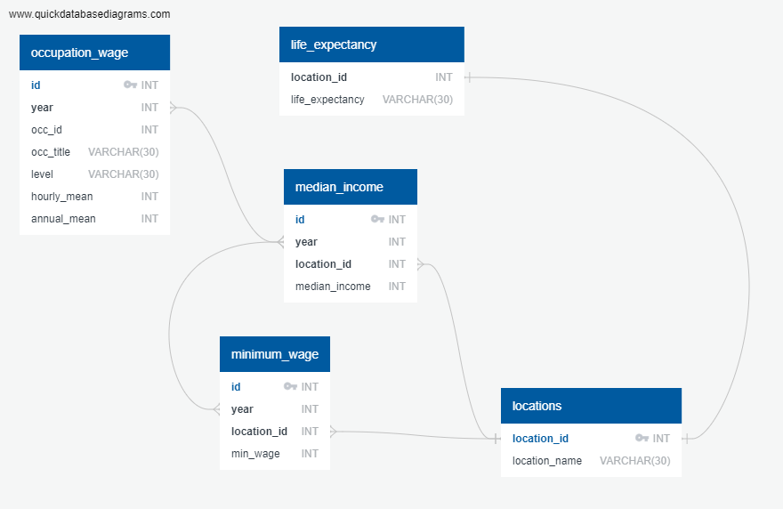

# **Extract Transform Load**

## **Introduction**

The goal of this project is to illustrate Extract Transform Load (ETL) using Excel, Python and SQL.  ETL is a process commonly done in computing, which takes raw data, cleans it and stores it for later use.  The extraction phase targets and retrieves the data.  Transform manipulates and cleans the data. Then load stores the data, typically in a data warehouse. After ETL is completed, the data can be used for analytics to help achieve business objectives.  
 
Our team (Jim Dale, Kat Heron, Alynda Her and Emily Mobley) decided to use compensation and life expectancy data for the project.  We chose compensation because it's a common topic that the average person can understand and thought it would be interesting to compare compensation across industry sectors and tie the results to predicted life expectancy.  

## **Data**

We obtained data from a variety of sources including the Bureau of Labor Statistics (BLS), Centers for Disease Control and Prevention, US Department of Labor (DOL) and Wikipedia.  
 
Our numeric data consists of compensation values, which can either be hourly rates or annual figures.  This assumes every individual is 1 full-time equivalent (does not work overtime).  The life expectancy data includes predicted estimates for the average number of years a person will live, which was modeled off of US Census data.  

The textual data includes industry sector, occupational group and location.  The first two allows grouping based on the type of job that is performed, while location will allow grouping based on the geographic location.  The locations are broken down by states and can be aggregated to a national level.  
 
Lastly the data includes years, which we decided to focus on data from 2009 - 2018.  
 
## **Extract**

For the data extraction phase, we took data from the 4 disparate sources and converted them to csv files.  In Jupyter Notebook, the data was imported by using the csv module which can read csv data.  The file paths were saved and the module can import data by connecting through the file path locations.  We developed the design of our database using quickdatabasediagrams.com.  On this website, you can name tables and columns and assign data types for your database.  Each table has a primary key and we linked the tables together using primary and foreign keys.  After the schema was designed, we exported the file and uploaded it into PGAdmin to create the structure of the database.  

 

## **Transform**

During the transformation phase, we performed various data cleaning tactics to get the data clean before loading into the database.  We developed a location table in order to connect multiple sources together by location id.  A couple of our datasets were 3 dimensional, with values listed as headers.  We transposed those values and lined them up with their respective data points in the dataset and renamed the titles.  Extra characters and notations were removed to make the data consistent. For example, some states provided a range of values for minimum wage, instead of 1 value.  In those cases, we took the higher value because the higher value was closer to the other values we saw for minimum wage.  Numeric values were converted to integers to keep the data types consistent with the database schema.  Data was sorted to help make the data readable and user-friendly.  Hyperlinks in the data were changed to simple text to prevent users from getting directed to various websites.  Dataframes were created which represent the data that was uploaded during the load phase.  Within the dataframes, important columns were selected and null values were removed to keep the tables focused on only relevant data.  Unique ids were created for the tables to ensure each table has a unique identifier.  

## **Load**

To execute the load phase, a connection was created between the Jupyter Notebook and PGAdmin.  We also imported SQLAlchemy, which is a Python module that enables you to connect the two applications.  The file path of the database was saved and an "engine" was created to form the connection.  Finally, the tables that were previously built are inserted into the database using the insert command, which completes the ETL process.  

## **Sources2**

* [“Changes in Basic Minimum Wages in Non-Farm Employment Under State Law: Selected Years 1968 to 2019.” U.S. Department of Labor]( https://www.dol.gov/agencies/whd/state/minimum-wage/history)

* [“List of U.S. States and Territories by Income.” Wikipedia, Wikipedia Foundation, 29 Mar. 2020](https://en.wikipedia.org/wiki/List_of_U.S._states_and_territories_by_income)

* [“National Occupational Employment and Wage Estimates 2014 – 2018.” U.S. Bureau of Labor Statistics, U.S. Bureau of Labor Statistics, 2 Apr. 2019](https://www.bls.gov/oes/2018/may/oes_nat.html)

* [“NVSS – United States Small-Area Life Expectancy Estimates Project.” U.S. Small-Area Life Expectancy Estimates Project (USALEEP), Centers for Disease Control and Prevention, 6 Mar. 2020](https://www.cdc.gov/nchs/nvss/usaleep/usaleep.html)
